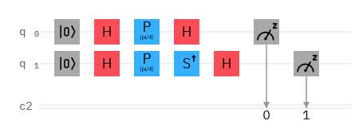

# CP1 2021 Homework3 Jinrui Bai 

## Introduction

This is a homework project for CP1 2021, which including assignments from #1 to #3. This project is mainly based on using quantum computer on IBM qiskit: [IBM Quantum Computer: https://quantum-computing.ibm.com/](https://quantum-computing.ibm.com/)

## Setup

Here is a detailed outline about what I did in this project:

1. I first made an account on IBM qiskit to start the homework;
2. For homework #1, I should make a full adder circuit that could at least calculate 1+2=3. So basically I used **the half adder** that was introduced in class **with additional cnot and toffoli gates** to build my full adder as shown below;

3. For homework #2, I implemented the full adder circuit above and **another circuit to determine the quantum phase** in IBM Quantum Lab. The picture of the circuit to determine the quantum phase is also shown below;

4. Then I setup and run both of my circuits on IBM qiskit and get my results as shown in the codes list;
5. Next I wrote the required documentation on the Jupyter Notebook from IBM Quantum Lab as shown in **Homework #2 P2 Jinrui Bai.ipynb**;
6. Last I followed the procedures in Homework #3 problem #1 to set up my git repository and all my works are shown.

## Results

My full adder circuit could calculate 1+2=3 as a classical computer do, but it requires more operators and gates to make it happen. Thus in summary, we should not use a quantum computer to solve classical problems in practice, though it is technically feasible.

## Discussion

Though my full adder circuit calculated 1+2=3 right, it took the quantum computer 10 seconds and 1000 trials to calculate it wrong in 30% of the cases. Thus there must be some better solutions for this simple classical problem but anyway this circuit helps me understand quantum computer.

## Outlook

My circuit could calculate more complex problems if I can attribute friction numbers to my variables or even extend them to imaginary numbers.
